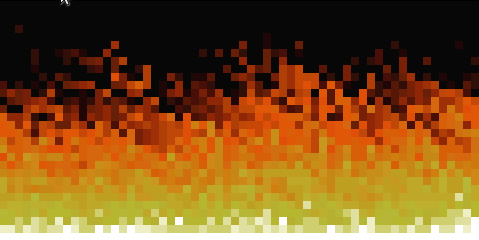

# Doom Fire

Resolvi fazer como exercício para aprender sobre JavaScript com um tutorial disposto pelo [Filipe Deschamps](https://github.com/filipedeschamps) com esse vídeo do [Fogo do DOOM](https://youtu.be/fxm8cadCqbs) e amei o resultado!

## Aprendizado

Neste momento eu não tinha nenhum conhecimento de JavasCript, entender como funcionam funções, variáveis, arrays e objetos. Isso foi importante pois até o momento eu só tinha conhecimento em C, e os vídeos do Filipe me fizeram entender muito, não só sobre a linguagem mas como ser um bom programador. Um desejo sincero é que todos tivessem a oportunidade de conhecer seus vídeos!
